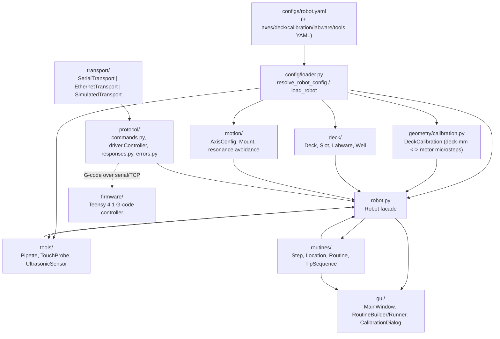

# Architecture

## Data flow

## Module responsibility table

| Module | Responsibility | Depends on |
|---|---|---|
| `core.py` | `AxisId`/`MountSide` -- the shared axis and mount vocabulary | - |
| `robot.py` | `Robot` facade: deck-space motion (`move_to`/`safe_move_to`), settle verification with stall detection and retry, tool attachment, labware registry | `core`, `geometry`, `motion`, `protocol`, `transport` |
| `config/loader.py` | YAML -> live objects: resolves `robot.yaml`'s composed references and builds `Robot`, `DeckCalibration`, `Deck`, axes, tips, and mounted tools | `geometry`, `deck`, `motion`, `tools`, `robot` |
| `geometry/calibration.py` | `DeckCalibration` -- the affine deck-mm <-> motor-microstep transform, plus Z probing/touch-off calibration | `core`, `motion.mounts`, `geometry.transform`/`units` |
| `geometry/transform.py` | `AffineTransform2D`, fit from 3+ deck/motor point pairs | - |
| `geometry/coordinates.py`, `geometry/units.py` | `DeckPoint`; microstep <-> mm/cm unit conversion | - |
| `deck/` | `Deck`, `Slot`, `Labware`, `Well` -- deck-space placement and geometry | `geometry.coordinates` |
| `motion/axis.py` | `AxisConfig`/`Axis` -- per-axis travel limits, speeds, resonance bands | `core` |
| `motion/mounts.py` | `Mount`, `MOUNT_OFFSET_MM` -- physical mount-to-gantry-reference geometry | `core` |
| `motion/resonance.py` | Feed-rate selection that steers clear of configured stepper resonance bands | `geometry.units` |
| `protocol/commands.py` | G-code `Command` rendering (moves, homing, probing, reports) | `core` |
| `protocol/driver.py` | `Controller` -- sends commands, blocks for acknowledgement, parses responses | `protocol.commands`/`responses`/`errors`, `transport.base` |
| `protocol/responses.py` | `Response`/`ProbeResult`/`DistanceResult` and their line parsers | `core` |
| `protocol/errors.py` | Typed `ControllerError` hierarchy; `map_error` translates a raw firmware failure reason into the most specific matching exception | `protocol.responses` |
| `transport/` | `Transport` implementations: `SerialTransport` (pyserial), `EthernetTransport` (TCP), `SimulatedTransport` (in-memory firmware emulator -- what the entire test suite runs against) | `transport.base` |
| `tools/pipette.py` | `Pipette`, `PlungerModel`, `PlungerCalibration` -- tip pickup/drop, aspirate/dispense, empirical or linear plunger curves | `tools.base`, `tools.tips`, `geometry.coordinates` |
| `tools/probe.py`, `tools/ultrasonic.py` | `TouchProbe`, `UltrasonicSensor` -- non-pipette tool implementations | `tools.base` |
| `tools/base.py` | `Tool` -- the mount-attachment lifecycle every tool implements (`on_attach`/`on_detach`, `uses_plunger`) | - |
| `routines/steps.py` | `Step` and its subclasses: home, move, pick up/drop tip, aspirate/dispense, switch mount, delay, comment | `core`, `robot`, `routines.location`, `tools.tips` |
| `routines/location.py` | `Location` and its subclasses (`WellLocation`, `SlotLocation`, `PointLocation`) -- semantic, robot-resolved deck references | `geometry.coordinates` |
| `routines/routine.py` | `Routine` -- an ordered, inspectable, runnable sequence of steps; threads mount side through `SwitchMountStep` | `core`, `routines.steps` |
| `routines/tip_sequence.py` | `TipSequence` -- row-major tip-well allocation for a rack | `routines.location` |
| `gui/` | PyQt5 application: connection bar, deck view, manual jog panel, calibration dialogs, routine builder/runner | everything above |

## Path and config conventions

`configs/robot.yaml` is the single entry point (`load_robot("configs/robot.yaml")`).
It composes reusable, independently-editable YAML files by relative
reference rather than inlining everything:

- `axes.yaml` -- per-axis overrides (only what differs from firmware
  defaults; anything omitted falls back to `motion.axis.default_axis_configs()`).
- `deck.yaml` -- the deck plate itself: slot geometry and fixed physical
  calibration marks. Deliberately separate from *which* labware sits in
  which slot -- that placement lives in `robot.yaml`'s own `labware:` list,
  so the same deck definition works across different labware layouts.
- `calibration.yaml` -- the fitted deck-mm <-> motor-microstep transform and
  Z zero references. Meant to be captured via the GUI's "Calibrate Deck..."
  dialog against `deck.yaml`'s calibration marks, not hand-edited.
- `labware/`, `tools/`, `pipette_tips/` -- reusable, slot-independent
  definitions (a tip rack's well grid, a pipette's plunger characteristics,
  a tip's physical geometry) referenced by name from `robot.yaml`.

A calibration captured from the GUI persists to a sidecar file next to the
config it was calibrated against (see `config.loader.calibration_sidecar_path`
/ `load_calibration_override`), so recalibrating and reconnecting with the
same `robot.yaml` never requires hand-editing `calibration.yaml` -- the
sidecar always wins over whatever the config file itself says.

## Deliberately kept simple

`motion.mounts.Mount.tool` is typed as plain `object`, not `tools.base.Tool`,
specifically to avoid an import cycle between `motion/` (which `robot.py`
and `geometry/calibration.py` both depend on) and `tools/` (which itself
depends on `geometry/`). Rather than introducing a shared low-level
interface package to break the cycle properly, the mount simply doesn't
import the tool hierarchy at all -- a real behavioral tradeoff (some call
sites need a `# type: ignore` where a tool method is invoked through this
loosely-typed attribute), accepted because the alternative is speculative
restructuring for a cycle that only bites at the type-checking layer, not
at runtime.

Similarly, `transport/` has one `Transport` interface and three concrete
implementations (serial, TCP, in-memory simulator) with no plugin registry
or factory -- `config.loader.build_transport` is a plain three-way
`if/elif` on a `type:` string. If a fourth transport is ever needed, add
another branch there; a registry abstraction isn't worth building until
there's a real reason transports need to be swapped in from outside this
codebase.
