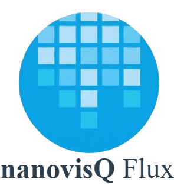

<p align="center">
  
</p>

# nanovisFlux

[](https://github.com/QATCH-Technologies/nanovisFlux/actions/workflows/build.yml)
[](https://github.com/QATCH-Technologies/nanovisFlux/actions/workflows/codeql.yml)
[](https://github.com/QATCH-Technologies/nanovisFlux/actions/workflows/style.yml)
[](https://github.com/QATCH-Technologies/nanovisFlux/actions/workflows/test.yml)
[](https://www.python.org/downloads/)
[](LICENSE)

nanovisFlux is a Python control library and GUI for operating QATCH
Technologies' nanovisFlux liquid-handling instrument -- an Opentrons OT-2
gantry retrofitted with an open-source Teensy 4.1 motion controller (see
[firmware/](firmware/)) that speaks a G-code protocol over serial. The
library owns everything above the wire: deck-space motion planning and
calibration, pipette/tool control, and a routine-authoring system for
composing repeatable liquid-handling sequences, plus a PyQt5 GUI for manual
jogging, deck calibration, and building/running routines interactively.

## Install

```bash
pip install -e .
```

Python 3.11.7 or newer is required. Optional extras add heavier,
feature-specific dependencies:

```bash
pip install -e ".[ml]"    # ultralytics/scikit-learn/torch, for vision-based tooling
pip install -e ".[test]"  # pytest/pytest-asyncio
```

`requirements.txt` is also available as a flat, all-in-one install
(matches what CI installs).

## Quickstart

### Python API

```python
from src.config.loader import load_robot
from src.core import MountSide
from src.geometry.coordinates import DeckPoint

# Builds a Robot from configs/robot.yaml -- axes, deck, calibration, tips,
# labware placement, and mounted tools all resolve from that one entry point.
robot = load_robot("configs/robot.yaml")

with robot:  # connects on entry, disconnects on exit
    robot.home()
    robot.safe_move_to(DeckPoint(x=50.0, y=50.0, z=10.0), MountSide.LEFT)
```

Pass `--port` to any script below to drive real hardware over serial;
omitting it runs against `SimulatedTransport`, an in-memory firmware
emulator, so every example works with no instrument attached.

### CLI

```bash
# Launch the manual-control / routine-builder GUI
python -m scripts.run_gui

# Run the example liquid-transfer routine (dry-run prints the plan without connecting)
python scripts/nanovis_transfer_example.py --dry-run

# Interactively characterize a pipette's plunger aspirate/dispense curves
python scripts/calibrate_pipette.py

# Sweep the rear ultrasonic sensor across the deck and render a topography map
python scripts/scan_deck_topography.py --dry-run
```

## Directory map

```text
src/
  core.py           AxisId / MountSide -- the shared axis and mount vocabulary
  robot.py          Robot: the top-level facade -- calibrated deck-space motion,
                     tool attachment, labware registry, settle verification
  config/            YAML config loading: robot.yaml and everything it composes,
                     plus the GUI-recalibration sidecar-override pattern
  control/           Manual input: JogController (continuous jog, feed selection,
                     resonance avoidance), gamepad/keyboard input adapters
  deck/              Deck, Slot, Labware, Well -- deck-space geometry and placement
  geometry/          DeckCalibration (deck-mm <-> motor-microstep transform),
                     AffineTransform2D, DeckPoint, AxisScale
  gui/               PyQt5 application: connection bar, deck view, manual control,
                     routine builder/runner, calibration dialogs
  motion/            AxisConfig/Axis, Mount, stepper resonance-band avoidance
  protocol/          G-code command rendering, response parsing, the typed
                     ControllerError hierarchy, and Controller (the request/response driver)
  routines/          Location (Well/Slot/Point), Step subclasses, Routine, TipSequence
  tools/             Pipette (+ PlungerModel/PlungerCalibration), TouchProbe,
                     UltrasonicSensor -- Tool implementations attachable to a mount
  transport/         Transport implementations: SerialTransport, EthernetTransport,
                     SimulatedTransport (in-memory firmware emulator used by the test suite)

configs/            YAML configuration: robot.yaml (entry point), deck.yaml,
                     calibration.yaml, axes.yaml, labware/, tools/, pipette_tips/, routines/
firmware/           Teensy 4.1 G-code motion-controller firmware (OT-2 replacement board)
scripts/            CLI entry points: run_gui.py, calibrate_pipette.py,
                     scan_deck_topography.py, nanovis_transfer_example.py
tests/              pytest suite, mirroring src/'s package structure module-for-module
```

See [ARCHITECTURE.md](ARCHITECTURE.md) for the data flow, module
responsibility table, and configuration conventions.

See [CONTRIBUTING.md](CONTRIBUTING.md) for development setup, testing, and
style guidelines.

## Core concepts

1. **Configuration** (`config/`) -- `configs/robot.yaml` is the single entry
   point: it composes axes, deck, calibration, tip geometries, labware
   placement, and mounted tools by relative reference into a ready-to-use
   `Robot`.
2. **Deck geometry** (`deck/`, `geometry/`) -- Slots, labware, and wells are
   addressed in deck-space millimeters; `DeckCalibration` is the affine
   transform between deck-mm and motor microsteps, fit from deck calibration
   marks (or hand-entered points) via the GUI's calibration dialog.
3. **Motion & protocol** (`motion/`, `protocol/`, `transport/`) -- Per-axis
   travel limits and speeds, G-code command rendering/response parsing, and
   pluggable transports (serial, TCP, or the in-memory simulator).
4. **Robot facade** (`robot.py`) -- Converts deck-space targets to calibrated
   motor coordinates, verifies motion completion against reported position
   (with stall detection and automatic retry), and manages tool attachment.
5. **Tools** (`tools/`) -- Pipette (empirical or linear plunger calibration),
   touch probe, and ultrasonic sensor implementations, each attachable to a
   mount.
6. **Routines** (`routines/`) -- Composable `Step` objects (home, move, pick
   up/drop tip, aspirate/dispense, switch mount, delay, comment) addressed
   via semantic `Location`s (well, slot, point) rather than raw coordinates.
7. **GUI** (`gui/`) -- PyQt5 application for manual jogging, deck
   calibration, and building/running routines interactively.
